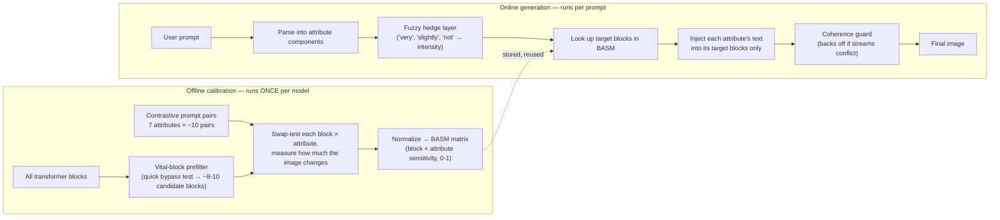

# FLAIR — Project Briefing for Supervisor Meeting

**Project:** FLAIR (`flair_t2i`) — Block-Routed Attribute Control for Text-to-Image Generation
**Target venue:** CVPR 2027 (author-targeted deadline: last week of November 2026 — unofficial, to be reconfirmed once the CFP posts ~Sept 2026)
**Author:** Solo researcher, Kaggle free-tier GPU only
**Current status:** Core method implemented and unit-tested (175 tests passing); calibration campaign not yet run

---

## 1. The problem, in one paragraph

Text-to-image models like Stable Diffusion 3.5 take one long prompt — e.g. *"a small red sports car under warm evening light"* — and encode it as a single block of text. The model has no way to separately control *how strongly* each attribute (color, size, lighting, etc.) is expressed, and attributes tend to bleed into each other or get ignored. FLAIR asks: **can we find which parts of the model's internals are actually responsible for each individual attribute, and then push each attribute's meaning directly into just those parts?** If so, we get independent control over color, size, lighting, etc. — "disentangled multi-attribute control" — without retraining the model.

## 2. The core idea (the novel contribution)

1. **Split the prompt** into its components — identity ("sports car"), color ("red"), size ("small"), lighting ("warm evening light"), etc.
2. **Calibrate, once, offline**: for the diffusion model's ~24 internal transformer blocks, measure — using controlled before/after prompt pairs — which blocks are most causally sensitive to each attribute. This produces a matrix: **BASM (Block–Attribute Sensitivity Matrix)**.
3. **At generation time**, look up each attribute's most-sensitive blocks in the BASM, and inject that attribute's own text embedding *only* into those blocks, as a weighted addition to the model's normal computation — not replacing the whole prompt, just nudging the relevant part of the network.
4. **A safety guard** watches for the attribute streams destabilizing the image and backs off the injection strength if they do.
5. **A fuzzy-logic layer** (the second contribution) lets phrases like "very red" or "slightly warm" produce continuously graded control instead of just on/off — using classical fuzzy-set operators (concentration, dilation, negation) rather than a fixed word lookup table.

**Why this is new:** Two existing methods are close but differ in a key way:
- *Stable Flow* (CVPR 2025) finds "vital" layers for image *editing*, not generation, and doesn't split by attribute.
- *HeadRouter* (2026) routes text influence adaptively *per image, at inference time* — nothing is precomputed.

FLAIR's matrix is computed **once, offline, from text-only contrastive pairs**, then reused for any prompt at generation time — and it routes at the *block* level, not the *attention-head* level (deliberately, to stay clearly distinct from HeadRouter). This offline/reusable + per-attribute framing is the paper's central claim.

## 3. The pipeline — two halves

The BASM is the bridge: expensive to build (hours of GPU time), cheap to use (a lookup) — so it's built once and every future image generation reuses it for free.

## 4. The 13-week plan and where we are now

| Week | Milestone | Status |
|---|---|---|
| 1 | Crisp (no-fuzzy) pipeline: parsing, routing math, injection, safety guard, first GPU smoke test | ✅ Done |
| 2 | Fuzzy hedge layer (graded "very"/"slightly"/"not" control) | ✅ Done |
| 3 | Calibration code: metrics, contrastive prompt corpus, vital-block prefilter | ✅ Done |
| 3-4 | **Run the actual calibration campaign on Kaggle GPU** → produces the real BASM | ⏳ **Next step** |
| 4 | Gate check: is the BASM meaningful? (no dead attributes, distinct blocks per attribute) | ⏳ Blocked on above |
| 5 | Tune injection strength / timing on real images | Not started |
| 6 | Build evaluation prompt set + absolute-quality metrics + baseline comparisons | Not started |
| **7** | **Go/No-Go checkpoint**: does FLAIR actually beat plain SD3.5 without breaking image quality? | Decision point |
| 8 | Ablation studies (prove each component matters) | Gated on Week 7 |
| 9 | One stretch goal only: either port to a second model (FLUX) or add fuzzy conflict resolution | Gated on Week 7 |
| 10 | Finalize all figures | — |
| 11-12 | Write the paper | — |
| 13 | Buffer / submit | — |

**Right now:** all the *logic* (175 automated tests, run in Docker, no GPU needed) is built and verified. What has **not** yet happened is spending GPU time to actually measure real block sensitivities — until that runs, the system technically works but routes every attribute to the same block (a known, expected placeholder state), so no image has meaningfully demonstrated the method yet.

## 5. Why this order makes sense

- **Everything that's just a decision (parsing, math, routing logic) is tested on CPU first**, so debugging costs zero GPU quota. The GPU (free-tier Kaggle, ~30 hours/week) is reserved only for the parts that truly need it: generating images and measuring sensitivity.
- **The calibration campaign is checkpointed** — if a Kaggle session dies mid-run (12-hour cap), it resumes from the last completed cell instead of restarting.
- **There's an explicit go/no-go gate at Week 7.** If FLAIR doesn't clearly outperform plain SD3.5 by then, the plan says to stop, cut scope, or retarget — rather than discovering that in Week 12 while writing.
- **Stretch goals (a second model backbone, fancier conflict handling) are deliberately gated** behind that Week-7 checkpoint and capped at "pick one" — this keeps a solo, GPU-limited project from overcommitting.

## 6. Immediate next step

Run `scripts/calibrate.py prefilter` then `scripts/calibrate.py basm` on Kaggle GPU to produce the first real BASM matrix, then check it against three validity criteria (no attribute with zero sensitivity anywhere, clear top-block per attribute, and different attributes peaking on *different* blocks — the last one is the paper's central premise, so if it fails, that's an early warning worth raising immediately rather than after months of further work).

## 7. Known risks

| Risk | Why it matters |
|---|---|
| Kaggle GPU quota is the tightest constraint | If calibration runs slowly, scope gets cut in a pre-agreed order: drop the second-model demo first, then reduce attribute count, then reduce calibration volume |
| The BASM might not show distinct peaks per attribute | Would mean there's no disentanglement to exploit — the paper's core premise. Caught at the Week 4 gate, not later |
| Solo project, no second reader | Plan to line up an outside read before submission |
| Repository is currently public on GitHub | Open question — may want to go private before submission to avoid being scooped, given the paper is not yet submitted |

---

*This document summarizes `docs/superpowers/specs/2026-08-25-flair-cvpr-publication-plan-design.md`, `docs/superpowers/specs/2026-08-25-flair-architecture-overview.md`, and `docs/superpowers/plans/2026-08-25-flair-master-roadmap.md`. See those files for full technical detail.*
