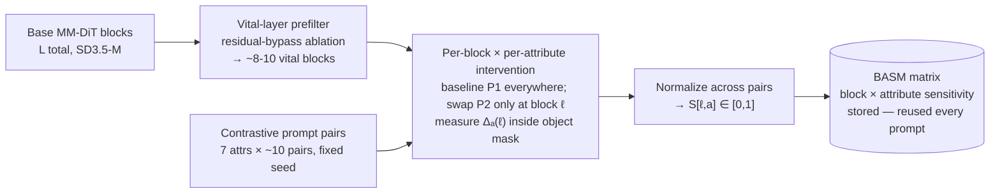
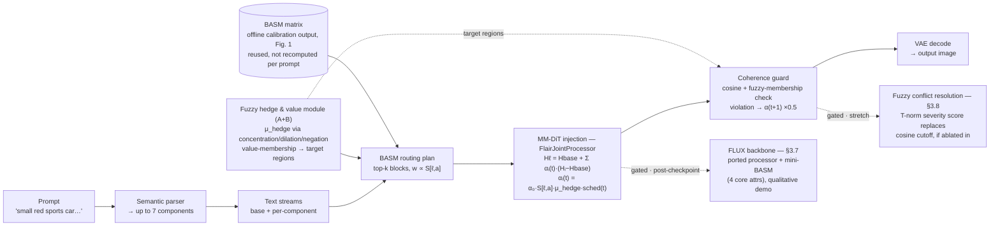

# FLAIR — Architecture Overview

**System architecture v3** — 7 attributes · fuzzy hedge-operators + value-membership (A+B) · gated FLUX demo & fuzzy conflict resolution
**Companion to:** [`2026-08-25-flair-cvpr-publication-plan-design.md`](./2026-08-25-flair-cvpr-publication-plan-design.md) — this doc maps 1:1 to that spec's §3.

> Per-attribute sensitivity in MM-DiT blocks, **calibrated offline** from contrastive text-only
> prompt pairs, routed at generation time to give **disentangled multi-attribute control** that a
> single concatenated prompt can't achieve — with graded, fuzzy-controlled attribute intensity as
> a second contribution.

## At a glance

| | |
|---|---|
| **Backbone** | SD3.5-M (primary) · FLUX (gated generalization demo, §3.7) |
| **Attributes** | 7 — Identity, Color, Size, Lighting, Texture, Style, Action |
| **Routing granularity** | Block-level only — head-level explicitly excluded (§2) |
| **Training** | None — inference-time only |

## Two pipelines

Calibration runs once, offline, and produces a matrix that's reused indefinitely. Generation runs
per prompt and consumes that matrix — it never recomputes sensitivity.

---

## 1 · Offline calibration

Finds which transformer blocks causally control which attribute, once per model, by swapping a
contrastive prompt pair into one block at a time and measuring the effect.

**Fig. 1** — The offline half. Runs once per backbone; nothing here depends on the prompt used at
generation time.

---

## 2 · Online generation & routing

Per prompt: parse into attribute components, fuzzify their hedge words, look up each component's
blocks in the BASM matrix, and inject each component's own text stream as a residual only at
those blocks — with a guard that can back off mid-generation.

**Fig. 2** — The online half. The core routing/injection mechanism and the fuzzy module are both
committed for this submission; the two dashed branches (FLUX backbone, fuzzy conflict resolution)
activate only after the Week 7 go/no-go checkpoint, and only if there's schedule slack.

---

## Component reference

Maps 1:1 to §3 of the spec doc — same order, same section numbers.

| § | Component | What it does | Status |
|---|---|---|---|
| 3.1 | Scope | 7 attributes kept; only Channel A text realization; head-level routing explicitly excluded. | Core |
| 3.2 | Semantic parsing | Deterministic spaCy dependency parse → `(identity, attribute-class, value)` tuples. | Core |
| 3.3 | Fuzzy hedge & value module | (B) Zadeh operators — concentration/dilation/negation — replace the lookup table. (A) membership functions over each attribute's metric universe give BASM a graded target and feed the guard. | Core |
| 3.4 | BASM calibration | Offline, causal, contrastive-pair intervention per vital block per attribute → `S[ℓ,a]`. ~1000-1400 generations. | Core |
| 3.5 | Routing & generation | `FlairJointProcessor` on every block; batch-layout bug must be fixed and verified first. | Core |
| 3.6 | Coherence guard | Cross-stream cosine check (unchanged) + fuzzy-membership distortion check (upgraded by §3.3-A). Backs off α on violation. | Upgraded |
| 3.7 | FLUX generalization demo | Ported processor + mini-BASM on 4 core attributes; small qualitative set. Starts only after the Week 7 checkpoint. | Gated |
| 3.8 | Fuzzy conflict resolution | T-norm/T-conorm severity score between streams, replacing the guard's cosine cutoff. Requires its own ablation or gets dropped. | Gated |

## Legend

- **Solid, neutral** — shared / foundational step
- **Solid, indigo (route)** — core routing & calibration mechanism
- **Solid, teal (fuzzy)** — fuzzy hedge / value module
- **Dashed, amber (gated)** — gated, post-Week-7-checkpoint, not committed for this submission

---

*Source: `docs/superpowers/specs/2026-08-25-flair-cvpr-publication-plan-design.md` · Target: CVPR
2027, last week of November 2026 (unofficial)*
